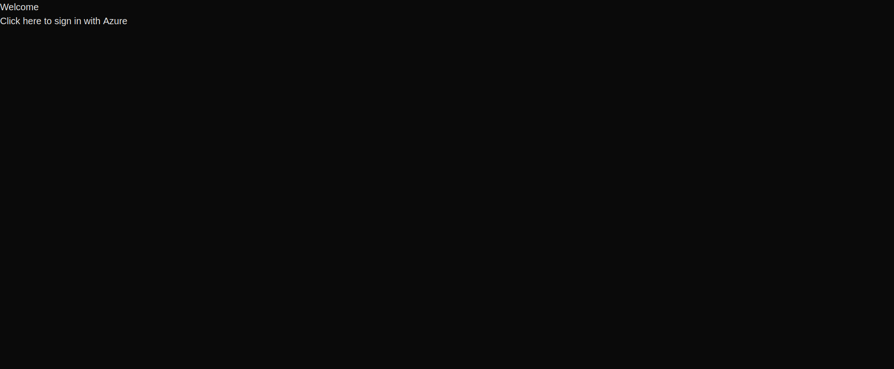
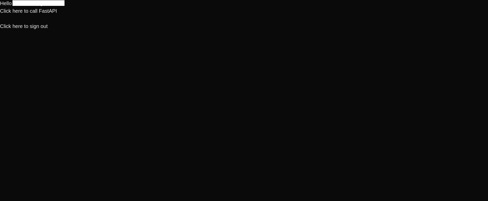
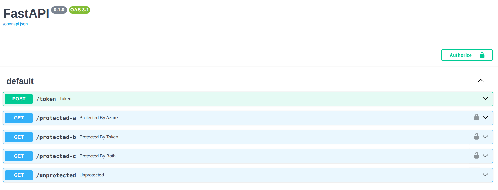

# azure-sso-demo
Basic demo of a Next.js app with SSO auth through Azure, with a protected Python back-end API.

The app is just a plain screen. If a user has not authenticated via Azure SSO, they will see a welcome message and a link to sign in. If they have authenticated, they will see a link to call a protected route in the back-end API, and another link to sign out.




Clicking the link to call FastAPI will show an alert that should say the user is authenticated. That indicates the endpoint (protected-a) was successfully called.



The back-end has 3 protected endpoints and 1 unprotected endpoint. The protected endpoints are protected by 3 different methods to show how they work:

1. protected-a is protected by Azure, requiring SSO to use (so it cannot be used at all without the front-end)
2. protected-b is protected by FastAPI's built-in Oauth, requiring a token requested through the back-end
3. protected-c is protected by Azure OR FastAPI's Oauth, so it can be accessed either by requesting a token through the back-end or by the front-end with SSO

## How it Works

The front-end routes a request to Azure for authentication, and Azure responds with a OpenID connect token (OIDC) for next-auth, and an Oauth2 token for the back-end, which are both in the JWT. It also makes email available in the session.

> **Note:** This demo uses the ID token to authorize the API, instead of the Oauth2 token. In practice, the ID token should only be used for authentication. To use the Oauth2 token to authorize the API, you will need to register a 2nd Azure app for the back-end, replace the environment variable values, and configure scopes.

Using the ID token to authorize the API instead of having a separate registered Azure app has its advantages and disadvantages. Here's a breakdown:

### Advantages of Authorizing with the ID Token Instead of the Oauth Token

1. Simplified Setup:
   - You only need one Azure app registration for both the front end and back end, reducing administrative overhead.
2. Unified Authentication:
   - The ID token is already issued as part of the authentication process, so you can reuse it without requiring additional token requests.
   - This simplifies the flow between the front end and back end.
3. Reduced Latency:
   - Since the ID token is already available after the user logs in, you avoid the need for an additional round trip to Azure AD to fetch an access token.
4. Easier Debugging:
   - With a single token, it is easier to trace and debug authentication issues across the front end and back end.

### Disadvantages of Authorizing with the ID Token Instead of the Oauth Token

1. Not Designed for Authorization:
   - The ID token is primarily intended for authentication (verifying the user's identity) and not for authorization (granting access to resources).
2. Limited Scope:
   - The ID token typically does not include granular permissions or scopes for API access, which are provided by an access token, making it harder to implement fine-grained access control.
3. Shorter Lifespan:
   - ID tokens often have a shorter expiration time compared to access tokens, which may require frequent reauthentication.
4. Potential for Misuse:
   - If the ID token is intercepted or misused, it could expose sensitive user information (e.g., claims like `email`, `name`, etc.).
   - Access tokens, on the other hand, are designed to be opaque and contain only the information needed for authorization.
5. Separation of Concerns:
   - Having a separate Azure app for the back-end allows you to define distinct permissions and roles for API access, which is harder to achieve with just the ID token.

## How to Run

Prerequisites:

- Register an Azure app (steps below)
- Create environment variables for the front-end and back-end

### Register an Azure App

Follow these steps in Azure:

1. Sign up for a free trial or pay as you go for Azure
2. Go to the Azure portal: https://portal.azure.com
3. Switch to the default directory for your new Azure subscription (top right > switch directory)
4. Search App Registrations and click the + button to start one
5. Name the app whatever you want
6. Choose the option for accounts in any org directory and personal accounts, assuming you are using a personal account, otherwise choose the option for single tenant
7. Skip redirect URIs for now

Once the app is registered, you can access it by name from the apps page. This will take you to the overview page.

1. Copy the application (client) ID and directory (tenant) ID for storage in environment variables
2. Look for the link by client credentials to add a client secret, give it a name, and copy the secret's value for the environment variable

From the overview page, look for the link to add a redirect URI and go there.

1. Click add platform, choose web, and paste your URL under redirect URIs, e.g. http://localhost:3000/api/auth/callback/azure-ad
2. If you need single sign out too, put the link to that page there (these links come from the front end's page structure)
3. Select which tokens you need. ID tokens are for OpenID connect tokens used by NextAuth for establishing logged in sessions. Access tokens are Oauth2 for the back-end API, which are needed if the front-end calls the API with Authorization bearer tokens.

Build your app and set the copied values as env variables.

### Create Environment Variables

The front-end expects the following variables in a file named `.env.local`

```txt
NEXTAUTH_URL=http://localhost:3000
NEXTAUTH_SECRET=<random-string>
AZURE_AD_CLIENT_ID=<your-client-id>
AZURE_AD_CLIENT_SECRET=<your-client-secret>
AZURE_AD_TENANT_ID=<your-tenant-id>
```

The back-end expects the following variables in a file named `.env`

```txt
AZURE_AD_CLIENT_ID=<your-client-id>
AZURE_AD_TENANT_ID=<your-tenant-id>
```

### Startup/Shutdown

Startup with Docker compose:

```bash
docker-compose up --build
```

Bring it down:

```bash
docker-compose down
```
